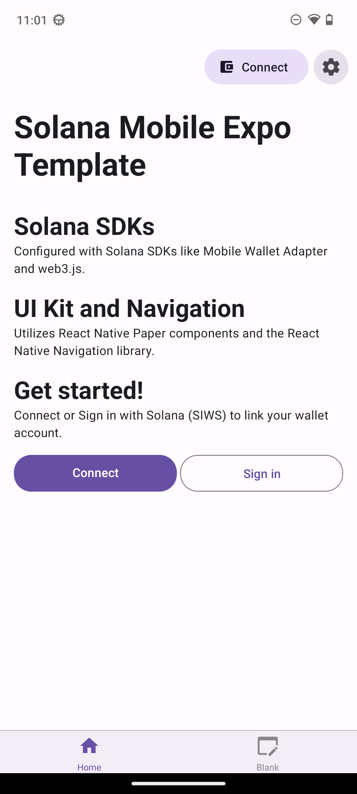
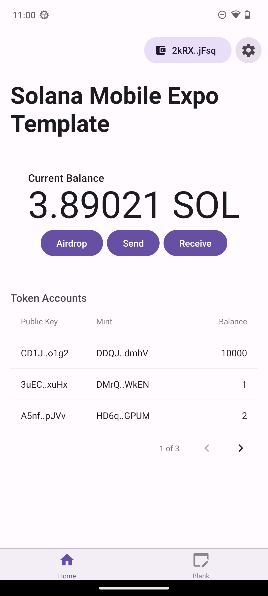
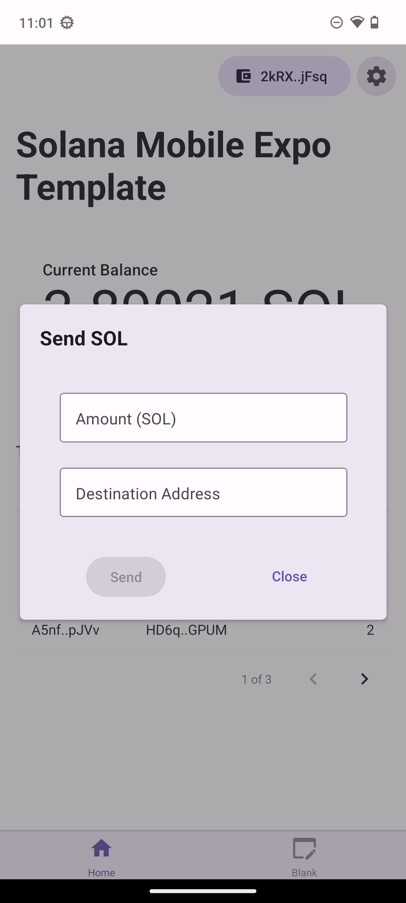

# Solana Mobile Expo Template

This template is a ready-to-go Android Expo dApp that offers:

- Solana libraries: `web3.js`, Mobile Wallet Adapter, and `spl-token`.
- Required polyfills like `crypto` and `Buffer` configured.
- Pre-built React UI and re-usable hooks and code patterns like `useMobileWallet`.

**This is only fully functional on Android.**

<table>
  <tr>
    <td align="center">
      
    </td>
    <td align="center">
      
    </td>
    <td align="center">
      
    </td>
  </tr>
</table>

## Tech Stack

| Library               | Category          | Version | Description                                           |
| --------------------- | ----------------- | ------- | ----------------------------------------------------- |
| React Native          | Mobile Framework  | v0.76   | The best cross-platform mobile framework              |
| Expo                  | SDK               | v52     | Allows (optional) Expo modules                        |
| React                 | UI Framework      | v18.3   | The most popular UI framework in the world            |
| Mobile Wallet Adapter | SDK               | v2.1    | Connect and request signing from mobile wallet apps   |
| Solana web3.js        | SDK               | v1.78   | General Solana library for transactions and RPCs      |
| spl-token             | SDK               | v0.4    | Library for building with Solana SPL tokens           |
| React Native Paper    | Component Library | v5.12   | Production-ready components following Material Design |
| React Navigation      | Navigation        | v6      | Performant and consistent navigation framework        |
| React Query           | State management  | v5.24   | Async query management                                |
| TypeScript            | Language          | v5      | Static typechecking                                   |
| AsyncStorage          | Persistence       | v1.23   | State persistence                                     |

## Quick Start

### Prerequisites

- A free [Expo](https://expo.dev/) account.
- An Android device/emulator to test your app
  - Install an MWA compliant wallet app on your device/emulator.
- If using Expo's cloud service `eas build`, no further setup is required.
- If building locally:
  - React Native and Android Envrionment [setup](https://docs.solanamobile.com/getting-started/development-setup)

### Initialize

Run the CLI command:

```
yarn create expo-app --template @solana-mobile/solana-mobile-expo-template
```

Choose your project name then navigate into the directory.

### Build and run the app

Once your app is initialized, follow the **["Running the app"](https://docs.solanamobile.com/react-native/expo#running-the-app)** guide to launch the template as a custom development build.

## Troubleshooting

- `Metro has encountered an error: While trying to resolve module @solana-mobile/mobile-wallet-adapter-protocol...`

  - This is an on-going issue when using `npm install` to install the Expo template.
  - To mitigate, clean your project dependencies and reinstall with `yarn install`

- `The package 'solana-mobile-wallet-adapter-protocol' doesn't seem to be linked. Make sure: ...`

  - Ensure you are _NOT_ using Expo Go to run your app.
  - You need to be using an [Expo custom development build](https://docs.solanamobile.com/react-native/expo#custom-development-build), rather than Expo Go.

- `failed to connect to...`

  - This is an Expo error that can occur when trying to connect to the dev server on certain Wifi networks.
  - To fix, try starting the dev server with the `--tunnel` command (`npx expo start --dev-client --tunnel`)

- `Error: crypto.getRandomValues() not supported`
  - This is a polyfill issue when trying to use certain functions from the `@solana/web3.js` in a React Native/Expo environment.
  - To fix, ensure your App properly imports and uses the polyfills like in this [guide](http://docs.solanamobile.com/react-native/expo#step-3-update-appjs-with-polyfills).

<br>

- `error Failed to load configuration of your project.`
  - Same as above, but for `yarn`. [Uninstall and reinstall](https://github.com/react-native-community/cli#updating-the-cli) the CLI through yarn.

<br>

- `Looks like your iOS environment is not properly set`:
  - You can ignore this during template initialization and build the Android app as normal. This template is only compatible with Android.

<br>

- `Usage Error: It seems you are trying to add a package using a https:... url; we now require package names to be explicitly specified.`
  - This error happens on certain versions of `yarn`, and occurs if you try to initialize the template through the Github repo URL, rather than the npm package. To avoid this, use the `@solana-mobile/solana-mobile-dapp-scaffold` package as specified, or downgrade your `yarn` version to classic (1.22.x).

<br>

- `error Couldn't find the ".../@solana-mobile/solana-mobile-dapp-scaffold/template.config.js file inside "@solana-mobile/solana-mobile-dapp-scaffold" template.`
  - This is a [known error](https://github.com/react-native-community/cli/issues/1924) that occurs with certain versions of `yarn` (>= 3.5.0). It is fixed by running the cli command with the `--npm` flag or downgrading your version of `yarn`.
